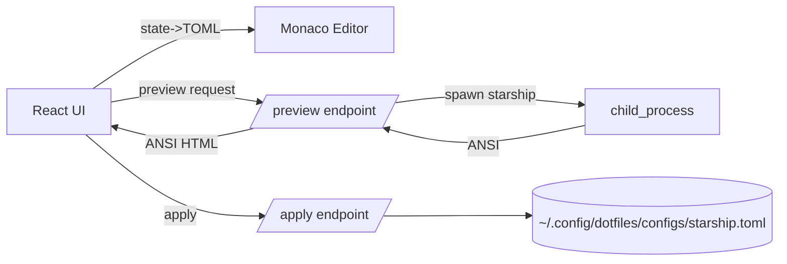

# Starship Prompt Visual Editor — Implementation Plan (1:1 Live Output)

Status: draft v1
Owner: platform/devtools
Audience: front-end + platform engineers
Target app: core/_internal-tools/starship-visual-generator (React + Vite)

## 1) Goal & Non‑Goals

- Goal
  - Build a graphical editor that lets you visually compose Starship prompt modules, edit colors via variables/palettes, and see a true 1:1 preview of what your shell would render, then export/apply to your managed dotfiles Starship TOML.
- Success criteria
  - Live preview shows exactly what `starship prompt` would output for a given context (ANSI parity, glyphs, line breaks, widths).
  - Round‑trip fidelity: TOML → UI → TOML produces stable, deterministic config (palettes + modules + format).
  - Can import any existing TOML, preserve unknown sections, and not lose settings.
  - Apply writes atomically to ~/.config/dotfiles/configs/starship.toml (or ~/.config/starship.toml) with backups and optional symlink management.
- Non‑goals (v1)
  - Full multi-user or remote editing; this is local tooling.
  - Arbitrary shell command preview beyond `starship prompt` output.

## 2) Constraints & Conventions

- Languages & stack
  - React 19, Vite 7, TypeScript only types (no interfaces), Zustand for state, Monaco for rich TOML editor.
  - No classes. Use named function declarations, no arrow function constants.
  - Types must be prefixed with T; a file with a single non-exported type uses TProps.
- Dotfiles integration
  - Active Starship config managed at ~/.config/dotfiles/configs/starship.toml (present in repo) and optionally symlinked to ~/.config/starship.toml via dotfiles-link.
- Security
  - Preview runs a local process (starship) with a temporary, sanitized config file and restricted environment. No network access.

## 3) High‑Level Architecture

- Front-end (React) panes
  - Module Library: available modules grouped by category (prompt, system, git, language, environment, custom).
  - Canvas: enabled modules with drag-to-reorder, toggle visibility, and delete.
  - Inspector: context-sensitive form controls for each module’s config (style, format, options) with color pickers bound to palette variables.
  - Palette Editor: edit named palette and associated color variables; validate hex; persist and emit TOML palettes.* blocks.
  - TOML Editor: Monaco editor with live, debounced sync to/from state and schema assist.
  - Terminal Preview: true ANSI rendering from the backend worker that spawns `starship prompt` against the current TOML and scenario cwd.
- Back-end (local dev + prod)
  - Preview endpoint: write temp config, set STARSHIP_CONFIG, spawn `starship prompt`, capture raw ANSI, return.
  - Apply endpoint: validate TOML, backup existing file, atomic write, optional symlink via dotfiles-link.
- In dev: use Vite middleware (already scaffolded). In prod: ship a Node/Next API route with same contracts.



## 4) Data Models (authoritative)

```ts path=null start=null
type TColorPalette = {
  name: string
  colors: Record<string, string>
}

type TStarshipModule = {
  id: string
  name: string
  displayName: string
  category: 'prompt' | 'directory' | 'git' | 'language' | 'environment' | 'custom' | 'system'
  enabled: boolean
  order: number
  config: Record<string, unknown>
}

type TPromptState = {
  format: string
  modules: TStarshipModule[]
  palette: TColorPalette
  customCommands: Record<string, string>
}

type TScenario = {
  id: string
  name: string
  description: string
  context: {
    directory: string
    gitStatus?: 'clean' | 'dirty' | 'detached' | 'ahead' | 'behind'
    hasNodeProject?: boolean
    hasRustProject?: boolean
    hasGoProject?: boolean
    hasPythonProject?: boolean
    dockerContext?: string
    kubernetesContext?: string
  }
}

type TPreviewRequest = {
  toml: string
  cwd?: string
  timeoutMs?: number
}

type TPreviewResponse = {
  ok: boolean
  output?: string
  error?: string
}

type TApplyRequest = {
  toml: string
  targetPath: string
  backup?: boolean
  createSymlink?: boolean
}

type TApplyResponse = {
  ok: boolean
  path?: string
  backupPath?: string
  error?: string
}
```

Notes
- Keep unknown TOML blocks round-trippable by retaining a raw map for unknown sections; only touch known ones on regeneration.
- Palette variables are always emitted as `palette`, with values in `palettes.<name>.*`, and styles can use `fg:color_*`/`bg:color_*` in module configs.

## 5) API Contracts

- POST /api/preview
  - Body: TPreviewRequest
  - Behavior
    - Write a temp file in OS tmpdir with 0600 perms.
    - Set STARSHIP_CONFIG to the temp path.
    - Set STARSHIP_SHELL=zsh (for ZSH-first accuracy).
    - Spawn `starship prompt` in provided cwd; cap runtime (default 2s) and output length (10KB) to protect UI.
    - Return raw ANSI bytes (as UTF-8 string) in output.
  - Errors: 400 for invalid body, 500 for spawn failures/timeouts.
- POST /api/apply
  - Body: TApplyRequest
  - Behavior
    - Validate TOML parse quickly.
    - If backup requested and file exists, copy to .bak.<timestamp>.
    - Ensure directory exists; write atomically (tmp → rename).
    - Optionally create or refresh symlink ~/.config/starship.toml via dotfiles-link if requested.

## 6) UI / UX Spec

- Layout
  - Left rail: Feature tabs (Starship active), Module Library below with search and categories.
  - Center: Canvas listing enabled modules (sortable) with status badges and errors.
  - Right split: Inspector (top), Terminal Preview (bottom). Splitter persisted per user.
  - TOML Editor modal (Monaco) with schema assist and two-way sync.
- Interactions
  - Drag modules from Library to Canvas. Drop order updates state.order and format builder.
  - Toggle module enable/disable; disabled modules persist config but are not in format.
  - Inspector renders dynamic fields from a schema descriptor; string, number, select, color field; supports palette token pickers and literal hex.
  - Palette Editor lets users pick a base palette (gruvbox_dark, fire, ice), edit variables, and save as a new palette name.
  - Keyboard shortcuts: Cmd/Ctrl+S apply, Cmd/Ctrl+E open editor, Cmd/Ctrl+Z undo, Cmd/Ctrl+Y redo.
  - Undo/redo stack covers module order, enabled flags, and config changes.
- Accessibility
  - All controls keyboard reachable; focus outlines; color contrast >= WCAG AA; tooltips provide descriptions.

## 7) Live Preview Engine (1:1 accuracy)

- Rendering
  - Keep existing dev Ansi→HTML flow as baseline.
  - Optionally add xterm.js for higher fidelity and VT sequence support. Use the same font as terminal (e.g. FiraCode Nerd Font).
- Execution
  - For ZSH parity, set STARSHIP_SHELL=zsh and mimic minimal env (HOME, USER, PATH), pass scenario cwd.
  - Provide canned scenarios (clean repo, dirty repo, deep path) and allow user to select a real path for live context.
- Failure modes
  - If starship is absent, show actionable info and a static preview.
  - If preview times out or errors, surface stderr in a collapsible panel.

## 8) TOML Sync & Round‑Trip

- Import
  - Parse with @iarna/toml.
  - Extract format → module order via regex `$module` scanning (preserve order uniqueness).
  - Build module list from format plus additional sections present in TOML.
  - Extract palette and palettes.* if present; fallback to default palette.
- Export
  - If user provides custom format string, use it; otherwise generate from enabled modules via deterministic builder (line breaks, segment escapes, and required character module at end).
  - Insert palette + palettes.* blocks when palette.name !== 'default'.
  - Append known custom modules (e.g., custom.dotfiles_version) if enabled, else omit.
- Conflict detection
  - Track last exported TOML hash and disk file mtime; warn on drift before apply.

## 9) File Apply & Backups

- Default target: ~/.config/dotfiles/configs/starship.toml.
- Options
  - Backup existing to .bak.<timestamp>.
  - Also create/update symlink to ~/.config/starship.toml via dotfiles-link (idempotent).
- Atomic write
  - Write to temp alongside destination, then rename.
- Post-apply hint
  - Prompt user to open a new shell or run `exec zsh`.

## 10) Security & Sandboxing

- Process
  - Allowlist binaries (resolve absolute path to `starship` once and cache), do not pass untrusted PATH.
  - Reject cwd paths with traversal; require they exist and be under user’s home by default.
  - Limit output size and execution time; kill process tree on timeout.
- HTTP
  - CSRF protect POST endpoints; same-origin only in local tool.
  - Rate-limit preview to e.g. 4 req/s with small burst.

## 11) Testing Strategy

- Unit (Vitest)
  - TOML parse/generate (golden file snapshots for core variants).
  - Palette validation (hex regex, missing keys).
  - Format builder correctness for special modules (line_break, character, custom.dotfiles_version).
- Integration
  - Preview endpoint with mocked starship binary and fixtures; verify timeout behavior and ANSI capture.
  - Apply endpoint writes atomically and creates backups.
- E2E (Playwright)
  - Drag modules, change palette color, see preview update, import TOML, export, apply, verify disk file.
- CI matrix
  - Linux + macOS runners; Node LTS; cache pnpm; run headless.

## 12) Performance

- Front-end
  - Debounce preview 250 ms; cancel in-flight requests on new edits.
  - Run TOML parse/generate in a Web Worker to keep UI responsive.
- Back-end
  - Reuse a persistent worker pool if we add more commands; v1 single spawn is fine.
  - Cache resolved starship path and version for diagnostics.

## 13) Observability

- Front-end
  - Console namespaces (starship:preview, starship:toml) gated by a Debug toggle.
- Back-end
  - JSON log lines with ts, pid, cwd, duration, bytes.
  - Optional Prometheus exporter (local only).

## 14) Phased Rollout

- Alpha
  - Dev-only feature; preview via Vite middleware (already implemented).
- Beta
  - Ship production API (Node or Next.js) bundling the same endpoints.
  - Add file apply and backup by default to dotfiles configs path.
- GA
  - Stabilize schema, add Undo/Redo, xterm.js rendering, and scenario switcher from real paths.

## 15) Detailed Task Breakdown

- Front-end
  - Replace arrow component exports with function declarations; remove default exports.
  - Introduce Palette Editor pane and color token picker component.
  - Inspector controls driven by a small descriptor per module.
  - Monaco editor integration with TOML language and debounce; two-way sync.
  - Terminal preview panel with fallback UI and error surface.
- Back-end
  - Extract Vite dev middleware into shared functions so it is reusable in prod API.
  - Production API: identical contracts, Node or Next.js route, same temp-file + spawn logic, shared validation.
  - Apply route: atomic write + backup + optional symlink via invoking dotfiles-link.
- TOML engine
  - Harden parse (unknown blocks), deterministic stringify ordering, and format builder with escapes.
- QA & Docs
  - Golden snapshots for known variants, README updates, usage tips.

## 16) Risks & Mitigations

- Starship version differences cause preview mismatches
  - Surface starship version in UI; add banner if unsupported version.
- Nerd font glyph differences between user terminal and web preview
  - Recommend font; let user choose installed font in settings; use xterm.js.
- Performance lag on rapid edits
  - Debounce + cancel in-flight + workerize TOML.

## 17) Open Questions

- Should prod API live inside a Next.js app (toast) or a small Node service shipped with the tool? Default: small Node service co-located with core/_internal-tools.
- Do we want streaming preview for very long prompts (SSE/WebSocket) or are small payloads fine? Default: full payload OK.
- Should Apply optionally run `exec zsh` or prompt the user only? Default: prompt only.

## 18) Implementation Notes (Repo Context)

- Existing assets to reuse
  - core/_internal-tools/starship-visual-generator/src/features/starship/lib/toml-generator.ts (parse/generate foundation)
  - core/_internal-tools/starship-visual-generator/src/features/starship/components/TerminalPreview.tsx (client side + preview request)
  - Vite dev API in vite.config.ts already implements /api/preview and /api/apply
  - Managed config present at ~/.config/dotfiles/configs/starship.toml
  - Dotfiles prompt variants tooling exists at starship-variants and bin/prompt
- Required refactors
  - Move dev API code into src/server/* to share with prod API.
  - Replace default exports and arrow components per code style rules.

## 19) Acceptance Checklist (Ship Blockers)

- Live preview matches `starship prompt` output for baseline scenarios (snapshots approved).
- Import existing TOML → no loss of unknown sections; export preserves intended order.
- Apply performs atomic write and backup; optional symlink created successfully.
- UI passes a11y basic checks and works without mouse.
- All unit/integration/E2E tests green on Linux CI.

